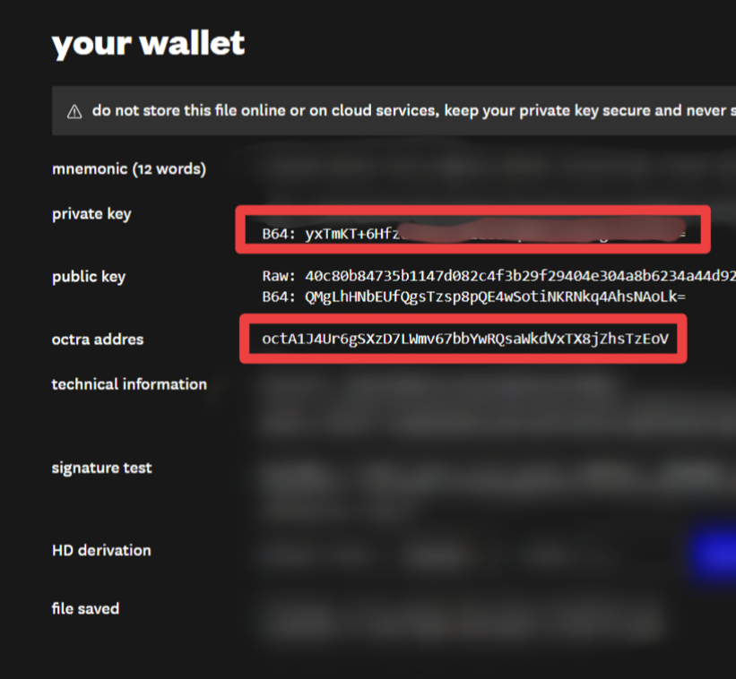

# STEP BY STEP WALLET GENERATION GUIDE OF OCTRA { CODESPACE }

---

## 🔹 Step 1: Install Bun

```bash
curl -fsSL https://bun.sh/install | bash
source ~/.bashrc
bun --version
````

---

## 🔹 Step 2: Install Dependencies

```bash
bun install
```

---

## 🔹 Step 3: Build the Project

```bash
bun run build
```

---

## 🔹 Step 4: Start the Server

```bash
bun start
```

> ✅ After this, click the **“PORTS”** tab in Codespace and open `localhost:8888` in browser.

---

**Done! Wallet Generator is live. 🔐**


---
# 🪙 TASK 1 : TOKEN TRANSFER

### 🔹 STEP 1: Open in Codespace

1. Go to 👉 [https://github.com/octra-labs/octra_pre_client](https://github.com/octra-labs/octra_pre_client)
2. Click the green `Code` button  
3. Select → `Open with Codespaces` → `+ New codespace`
4. Wait for the environment to fully load

---

### 🔹 STEP 2: Install dependencies

In the Codespace terminal, run:

```bash
pip install -r requirements.txt
````

---

### 🔹 STEP 3: Create and edit wallet.json

Create the wallet file:

```bash
cp wallet.json.example wallet.json
```

Then open the file: wallet.json

Paste your test wallet details (⚠️ never use your real wallet):



```
{
  "priv": "private key here",
  "addr": "octxxxxxxxxxxxxxxxxxxxxxxxxxxxxxxxxxxxxxxxx",
  "rpc": "https://octra.network"
}
```

---

### 🔹 STEP 4: Send a test transaction

```bash
python cli.py send --to oct5ziFzQJkiJFPfcQeuAmp4vhfQgjwb8gyx2W2TZdGhzJm --amount 0.01
```

🟢 That’s it! You can now access the wallet UI and make transactions to addresses found on the explorer: https://octrascan.io/

---
---
# 🪙 TASK 2 : ENCRYPT / DECRYPT BALANCE

### 🔹 STEP 1: Follow Task 1 Steps & Open Wallet UI

---

### 🔹 STEP 2: 


• Use Command `4` For Encrypt  
• Use Command `5` For Decrypt  

Keep doing transactions, you can also use other commands like `6` & `7` for private Transfer & Claim , Use Address From Explorer: https://octrascan.io/

---


📢 **JOIN TG FOR UPDATES**: [t.me/EarnByAbhi23](https://t.me/EarnByAbhi23)

